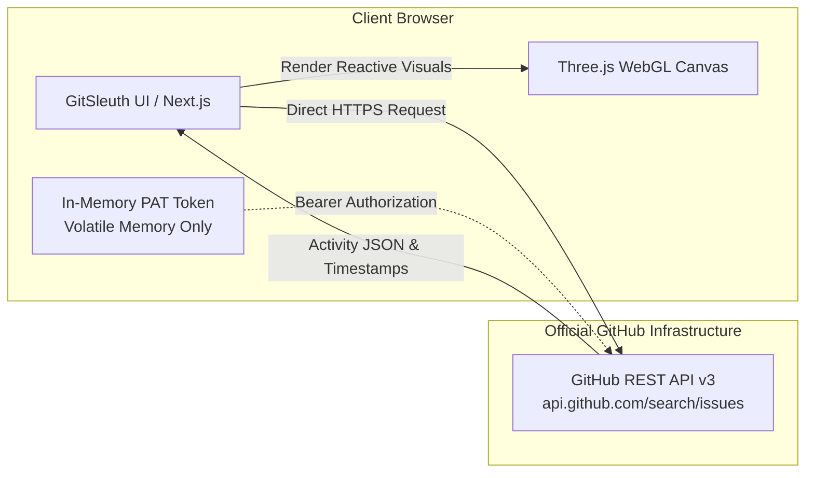

<div align="center">

# 🕵️‍♂️ GitSleuth

### **Precision GitHub Activity Timing & Contributor Telemetry Engine**

_Uncover exact timestamps, PR lifecycles, and issue velocities with sub-second precision — directly from GitHub's REST API with zero intermediate storage._

<br/>

[](https://nextjs.org/)
[](https://react.dev/)
[](https://www.typescriptlang.org/)
[](https://tailwindcss.com/)
[](https://threejs.org/)
[](https://docs.github.com/en/rest)
[](LICENSE)

<br/>

[**Live Application**](#getting-started) • [**Key Features**](#-key-features) • [**Architecture & Privacy**](#-architecture--zero-storage-privacy) • [**Quickstart**](#-getting-started) • [**Usage Guide**](#-usage-guide) • [**Contributing**](#-contributing)

</div>

## ⚡ Overview

Standard GitHub profile activity graphs summarize contributions into coarse daily aggregates, obscuring the exact rhythm of engineering work. **GitSleuth** changes that by querying GitHub's official REST API v3 in real time to provide an interactive, sub-second telemetry stream of pull requests, commits, and issues.

Whether you are auditing sprint lifecycles, tracking hackathon submissions, conducting code review retrospectives, or validating open-source contributions, GitSleuth renders every milestone with complete ISO 8601 timestamp transparency over an interactive 3D WebGL background.

### Why GitSleuth?

- ⏱️ **Sub-Second Precision**: See exact submission, merge, and closing times with local timezone conversion.
- 🛡️ **100% Client-Side Privacy**: Direct browser-to-GitHub HTTPS queries. Zero databases, zero logging, zero telemetry proxies.
- 🪐 **Interactive 3D Atmosphere**: Cyberpunk-inspired WebGL neon tube canvas that reacts dynamically to user cursor movement.
- 🎯 **Granular Filtering**: Filter activity by contributor, PRs, issues, and custom Flatpickr calendar date ranges.
- 🔑 **Scalable Rate Limits**: Instant public queries (60 req/hr) or authenticated in-memory Personal Access Token (PAT) boosting to **5,000 req/hr**.

## 🚀 Key Features

<table>
  <tr>
    <td width="50%">
      <h3>🔍 Deep PR & Issue Telemetry</h3>
      <p>Inspect comprehensive metadata for every pull request and issue: lifecycle status badges, author avatars, repository identifiers, and exact timestamps down to the second.</p>
    </td>
    <td width="50%">
      <h3>📅 Granular Date Windows</h3>
      <p>Target specific sprints, milestones, or release intervals using embedded Flatpickr date range controls with preset filters and instant query recomputation.</p>
    </td>
  </tr>
  <tr>
    <td width="50%">
      <h3>🔒 Zero-Storage Privacy Model</h3>
      <p>Personal Access Tokens reside exclusively in volatile client browser memory. Nothing is ever saved to <code>localStorage</code>, cookies, or remote analytical servers.</p>
    </td>
    <td width="50%">
      <h3>🎨 High-Performance 3D WebGL</h3>
      <p>Fluid, interactive neon light tube background powered by Three.js with full mobile touch-awareness, auto-panning fallback, and adaptive resolution scaling.</p>
    </td>
  </tr>
  <tr>
    <td width="50%">
      <h3>⚡ Real-Time API Rate Tracking</h3>
      <p>Inspect header status diagnostics, response counts, and remaining GitHub API quota with clear visual warning alerts before limits are hit.</p>
    </td>
    <td width="50%">
      <h3>📜 Continuous Scroll Streaming</h3>
      <p>Effortlessly load deep historical timelines through asynchronous multi-page fetching with responsive load-more indicators and debounced state updates.</p>
    </td>
  </tr>
</table>

## 🏗 Architecture & Zero-Storage Privacy

GitSleuth is designed with a **direct client-to-API** topology. Traditional developer telemetry tools route user requests and credentials through private backend proxies; GitSleuth eliminates the middleman entirely.



> [!NOTE]
> **Privacy Guarantee:** GitSleuth does not operate a database, tracking service, or external analytics platform. All requests execute directly against `https://api.github.com` via client-side fetch.

## 🛠 Tech Stack

| Domain           | Technology                                                           | Description                                                            |
| :--------------- | :------------------------------------------------------------------- | :--------------------------------------------------------------------- |
| **Framework**    | [Next.js 16](https://nextjs.org/) (App Router)                       | High-performance React framework with server-side layout optimizations |
| **UI Library**   | [React 19](https://react.dev/)                                       | Modern reactive components and hooks architecture                      |
| **Language**     | [TypeScript 5](https://www.typescriptlang.org/)                      | Strict type-safety across all GitHub API schemas                       |
| **Styling**      | [Tailwind CSS v4](https://tailwindcss.com/)                          | Next-generation utility-first styling with custom CSS design tokens    |
| **3D Graphics**  | [Three.js](https://threejs.org/) & `threejs-components`              | Interactive WebGL neon tube canvas and particle physics                |
| **Date Engine**  | [Flatpickr](https://flatpickr.js.org/)                               | Lightweight, customizable date interval selector                       |
| **Icons**        | [Lucide React](https://lucide.dev/)                                  | Consistent, lightweight SVG icon package                               |
| **Code Quality** | [ESLint 9](https://eslint.org/) & [Prettier 3](https://prettier.io/) | Automated code standardization and strict formatting                   |

## 🚦 Getting Started

### Prerequisites

Ensure you have installed:

- [Node.js](https://nodejs.org/) `>= 18.18.0` (Node 20+ recommended)
- `npm`, `pnpm`, or `yarn`

### Installation

1. **Clone the repository:**

   ```bash
   git clone https://github.com/ErebAsh/GitSleuth.git
   cd GitSleuth
   ```

2. **Install project dependencies:**

   ```bash
   npm install
   ```

3. **Launch the development server:**

   ```bash
   npm run dev
   ```

4. **Open in browser:**
   Navigate to [http://localhost:3000](http://localhost:3000) to view the application.

### Production Build

To produce an optimized production bundle:

```bash
npm run build
npm run start
```

## 📖 Usage Guide

```
+--------------------------------------------------------------------------+
|  Step 1: Enter Target GitHub Username (e.g. 'torvalds', 'shadcn')         |
+--------------------------------------------------------------------------+
                                    │
                                    ▼
+--------------------------------------------------------------------------+
|  Step 2: Select Filter Type (All Activity | Pull Requests | Issues)       |
+--------------------------------------------------------------------------+
                                    │
                                    ▼
+--------------------------------------------------------------------------+
|  Step 3: (Optional) Set Custom Date Window via Flatpickr Range Calendar  |
+--------------------------------------------------------------------------+
                                    │
                                    ▼
+--------------------------------------------------------------------------+
|  Step 4: (Optional) Input GitHub Personal Access Token (PAT)             |
|          → Unauthenticated: 60 req/hr | Authenticated: 5,000 req/hr      |
+--------------------------------------------------------------------------+
                                    │
                                    ▼
+--------------------------------------------------------------------------+
|  Step 5: Click "Trace Activity" & Explore Sub-Second Precision Timeline   |
+--------------------------------------------------------------------------+
```

### Rate Limiting Comparison

| Authentication Mode             | API Limit        | Ideal Use Case                                                |
| :------------------------------ | :--------------- | :------------------------------------------------------------ |
| **Public / Anonymous**          | `60 req / hr`    | Quick checks, single-user lookups, casual profile exploration |
| **Personal Access Token (PAT)** | `5,000 req / hr` | Sprint auditing, deep retrospectives, large repo inspection   |

> [!TIP]
> You only need a PAT with public read permissions (`public_repo` or fine-grained public read). No write or account modification scopes are ever required.


## 📁 Directory Structure

```text
GitSleuth/
├── public/                 # Static assets, favicons, illustrations
├── src/
│   ├── app/                # Next.js App Router pages and metadata
│   │   ├── layout.tsx      # Root application layout with 3D canvas mount
│   │   ├── page.tsx        # Modern landing showcase with feature walkthrough
│   │   ├── globals.css     # Design tokens, glassmorphism utilities & animations
│   │   └── tracker/        # Dedicated interactive Search Workspace
│   │       └── page.tsx    # Telemetry streaming engine & timeline view
│   ├── components/
│   │   ├── canvas/         # Three.js WebGL TubesBackground component
│   │   ├── layout/         # Responsive Navbar & Footer components
│   │   └── tracker/        # SearchForm, DatePicker, and TimelineItem cards
│   ├── lib/
│   │   ├── github.ts       # GitHub REST v3 search query builder & API caller
│   │   ├── date-utils.ts   # Sub-second timestamp and ISO formatting helpers
│   │   └── seo.ts          # Dynamic metadata, section hashing & OpenGraph sync
│   └── types/
│       └── github.ts       # TypeScript interfaces for GitHub API responses
├── package.json            # Scripts & project dependencies
└── README.md               # Project documentation
```

## 🤝 Contributing

Contributions make the open-source community an inspiring place to learn, inspire, and create. Any contributions you make are **greatly appreciated**.

1. Fork the Project
2. Create your Feature Branch (`git checkout -b feature/AmazingFeature`)
3. Commit your Changes (`git commit -m 'Add some AmazingFeature'`)
4. Push to the Branch (`git push origin feature/AmazingFeature`)
5. Open a Pull Request

Please ensure code conforms to project formatting:

```bash
npm run format:check
npm run lint
```


## 📄 License

<div align="center">

Distributed under the **MIT License**. See [`LICENSE`](LICENSE) for more information.

Crafted with care by [**ErebAsh**](https://github.com/ErebAsh) • Built for Developers Worldwide 🌍

</div>
